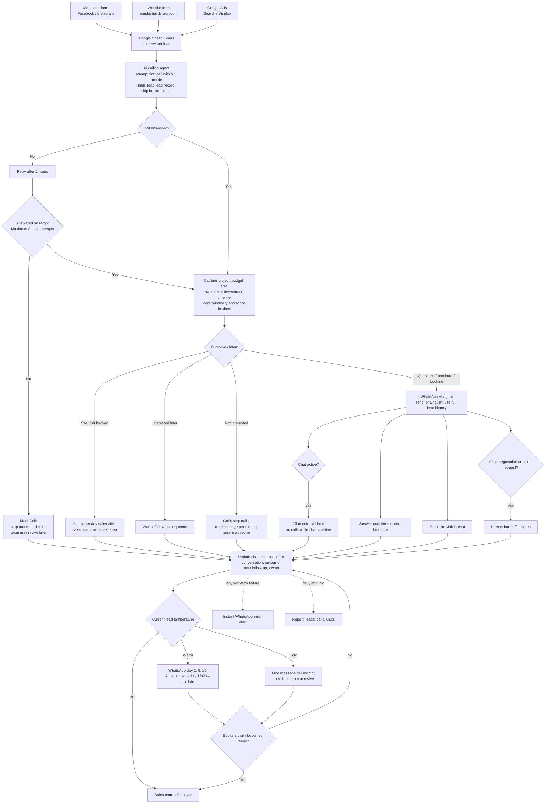

# Lead Management Workflow

## One end-to-end flow

## Operating rules

1. **One record per lead:** Google Sheet is the shared source of truth. Store contact details, source, consent/communication preference, status, score, call/chat summaries, attempts, hold, follow-up date, and assigned owner.
2. **One owner at a time:** Automation owns new leads and scheduled follow-up. Sales owns Hot leads and any explicit human handoff. Log the owner and handoff time.
3. **Stop duplicate outreach:** Before any call or message, check the latest status, active WhatsApp hold, opt-out, booked visit, and last contact time. A booking or opt-out suppresses all queued outreach immediately.
4. **Call policy:** First attempt within one minute; retry unanswered leads after two hours, capped at three total attempts. Then mark Cold and stop automated calls.
5. **WhatsApp policy:** Use lead history; pause calls during an active chat for 30 minutes. Answer questions, share approved brochure material, and book visits. Route price negotiation or requested human help to sales.
6. **Temperature policy:** Hot means a visit is booked or purchase intent is within 30 days; alert sales the same day. Warm means interested in 1–3 months; use the scheduled day 2, 5, 10 messages and a dated call. Cold means no answer after three attempts, not interested, or not ready; no calls and at most one monthly message where permitted. If a Warm/Cold lead books a visit or becomes ready, promote to Hot.
7. **Monitoring:** Send an immediate WhatsApp alert on workflow failures. Send one daily 1 PM report with lead, call, and visit counts.

## Build notes and decision points

- The screenshots describe intended behavior, not verified integrations. Connectors, permissions, timing, and spreadsheet fields still need implementation and validation.
- Confirm consent and applicable messaging rules before automated calls or WhatsApp messages; honor opt-outs across every channel.
- The diagram suggests WhatsApp messages to Cold leads. Apply that only where the person has the required permission and the message is allowed; otherwise suppress it.
- Define what “active chat” means operationally (for example, a recent inbound message) and extend the hold when the conversation continues, so calls do not resume mid-conversation.
- Choose a reliable lead identifier and deduplicate on intake (normalized phone number plus source/form context) to prevent duplicate records and parallel calls.
